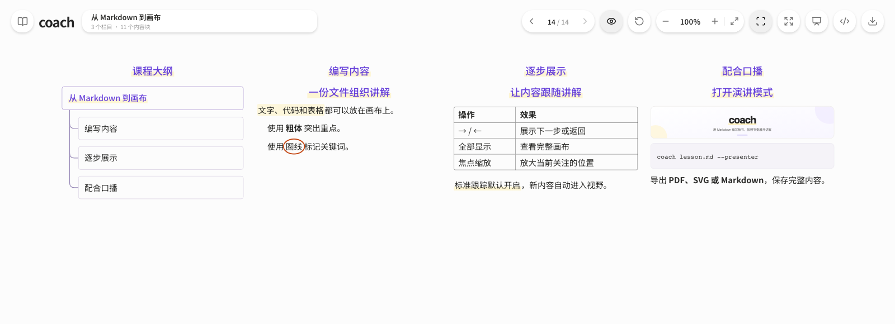
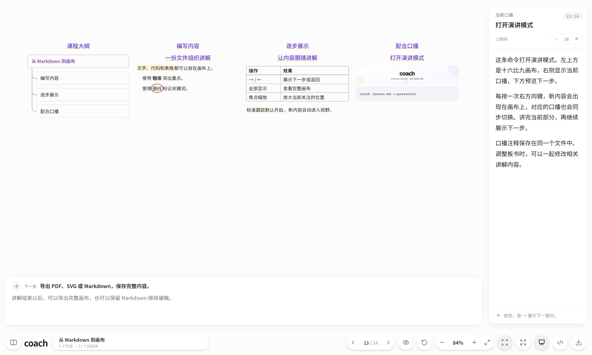

<div align="center">
  
  <p>
    <a href="#快速开始">快速开始</a> ·
    <a href="#编写内容">编写内容</a> ·
    <a href="#演讲与录制">演讲与录制</a> ·
    <a href="docs/cli.md">命令文档</a>
  </p>
  <p><strong>Markdown 编写</strong> &nbsp; / &nbsp; <strong>逐步展示</strong> &nbsp; / &nbsp; <strong>同步口播</strong> &nbsp; / &nbsp; <strong>PDF · SVG 导出</strong></p>
</div>



Coach 将文字、图片、代码和表格排布在同一张画布上。栏目从左向右排列，内容从上向下展开；使用方向键控制进度，摄像头自动跟随当前内容。

## 快速开始

需要 **Node.js ≥ 22.12** 和 npm。

```bash
git clone https://github.com/gevico/coach.git
cd coach
npm ci
npm run build
npm link
```

保存下方示例为项目根目录中的 `lesson.md`，然后打开：

```bash
coach lesson.md
coach lesson.md --presenter
```

命令会启动本地服务并打开浏览器。使用 `Ctrl+C` 停止服务；也可以通过 `npm start -- lesson.md` 启动。

## 编写内容

一份 Markdown 同时保存板书和口播注释：

<details>
<summary>展开完整 Markdown 示例</summary>

````markdown
# 从 Markdown 到画布
<!-- speaker: 今天演示怎样编写内容、逐步展示，并配合口播进行讲解。 -->

## 编写内容
<!-- speaker: 首先把需要展示的内容写进 Markdown。 -->

### 一份文件组织讲解
<!-- speaker: 标题决定栏目和板块，正文安排每一步要展示的内容。 -->

:highlight[文字、代码和表格]都可以放在画布上。
<!-- speaker: 内容保留在同一张画布上，讲解时逐项展开。 -->

- 使用 **粗体** 突出重点。
  <!-- speaker: 粗体使用 Markdown 的标准语法。 -->
- 使用 :circle[圈线] 标记关键词。
  <!-- speaker: 圈线在内容首次出现时绘制，完成后保持显示。 -->

## 逐步展示
<!-- speaker: 内容准备好以后，按照自己的节奏推进。 -->

### 让内容跟随讲解
<!-- speaker: 使用方向键切换，摄像头自动跟随当前内容。 -->

| 操作 | 效果 |
| --- | --- |
| → / ← | 展示下一步或返回 |
| 全部显示 | 查看完整画布 |
| 焦点缩放 | 放大当前关注的位置 |
<!-- speaker: 可以逐步讲解，也可以展开全貌。鼠标和触摸板控制平移与缩放。 -->

:shade[标准跟踪默认开启]，新内容自动进入视野。
<!-- speaker: 新的标题靠近视口上方显示，并保留适当间距。 -->

## 配合口播
<!-- speaker: 演讲模式把板书和当前口播放在同一个窗口中。 -->

### 打开演讲模式
<!-- speaker: 添加 presenter 参数即可打开演讲布局。 -->


<!-- speaker: 图片使用标准 Markdown 语法，可以填写本地路径或网络链接。 -->

```bash
coach lesson.md --presenter
```
<!-- speaker:
这条命令打开演讲模式。左上方是十六比九画布，右侧显示当前口播，下方预览下一步。

每按一次右方向键，新内容会出现在画布上，对应的口播也会同步切换。讲完当前部分，再继续展示下一步。

口播注释保存在同一个文件中。调整板书时，可以一起修改相关讲解内容。
-->

导出 **PDF、SVG 或 Markdown**，保存完整内容。
<!-- speaker: 讲解结束以后，可以导出完整画布，也可以保留 Markdown 继续编辑。 -->
````

</details>

`#` 设置课程名称，`##` 创建栏目，`###` 创建板块。一级、二级标题自动生成开场大纲。段落、顶层列表项、图片、代码块和表格分别构成展示步骤。

`speaker:` 注释显示在演讲模式的口播区域；注释附在对应内容之后，列表内按所属项目缩进。重点标记支持 `:highlight[高亮]`、`:circle[圈线]` 和 `:shade[底部阴影]`。

## 演讲与录制



演讲模式在左上方显示 **16:9 画布**，右侧显示当前口播，下方预览下一步。口播默认 **16px**，可以调整字号。

| 快捷键或手势 | 操作 |
| --- | --- |
| `→` / `←` | 下一步 / 上一步 |
| `P` | 切换演讲模式 |
| `F` / `Esc` | 进入禅模式 / 退出当前模式 |
| 鼠标拖动、触摸板滚动 | 平移画布 |
| 触摸板捏合、`Ctrl` / `Meta` + 滚动 | 围绕指针缩放 |

在 macOS 的演讲模式中，点击 **Mac 录制**，准备五秒后开始讲解。麦克风默认开启，保存时自动移除准备期间的画面与音频；默认保存到 `~/Movies/Coach`，可以在界面或通过 `--record-dir` 指定目录。

首次录制需要 Apple Command Line Tools，以及终端的辅助功能、屏幕录制和麦克风权限。保存设置、独立口播文件与完整参数见 [命令文档](docs/cli.md)。

## 导出与开发

工具栏支持导出 **PDF、SVG 和 Markdown**。PDF、SVG 包含当前画布的全部内容；Markdown 保留口播注释。网络图片导出需要图片服务器允许跨域读取。

```bash
npm run dev
npm run build
npm test
```

项目采用 [MIT 许可证](LICENSE)。中文字体采用 [SIL Open Font License](public/licenses/noto-sans-sc.txt)。
